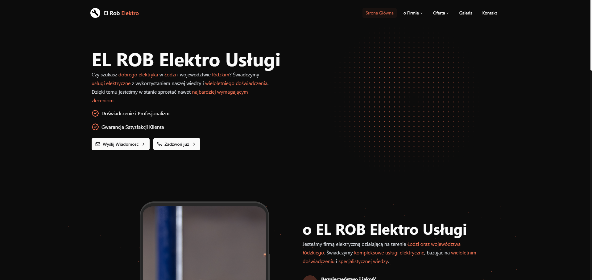

## 📑 Spis Projektu

- [Projekt](#-projekt)
- [Technologia](#-technologia)
- [Instalacja](#-instalacja)

## 🚀 Projekt

<p>
    Zrobiłem projekt strony internetowej dla EL-ROB Elektro Usługi Łódź. 
    Firma zajmuje się instalacjami elektrycznymi, modernizacjami, serwisem i pomiarami. 
    Stronę stworzyłem w Next.js z TypeScript i Tailwind CSS, a do zarządzania kodem użyłem Gita.
</p>

## 🛠️ Technologia

| Kategoria | Technologie                                                                                                         |
| --------- | ------------------------------------------------------------------------------------------------------------------- |
| Frontend  | [TypeScript](https://www.typescriptlang.org/), [Tailwind](https://tailwindcss.com/), [Next.js](https://nextjs.org/) |
| Backend   | Brak                                                                                                                |
| Inne      | [Git](https://git-scm.com/book/pl/v2/Pierwsze-kroki-Podstawy-Git)                                                                                                      |


## 💻 Instalacja

```bash
- git clone https://github.com/Kubaleek/elrob.pl.git
- npm install
- npm run dev
```

Otwórz http://localhost:3000 w swojej przeglądarce
Aby zbudować aplikację w celu wdrożenia w środowisku produkcyjnym.

```bash
- npm run build
- npm start
```
